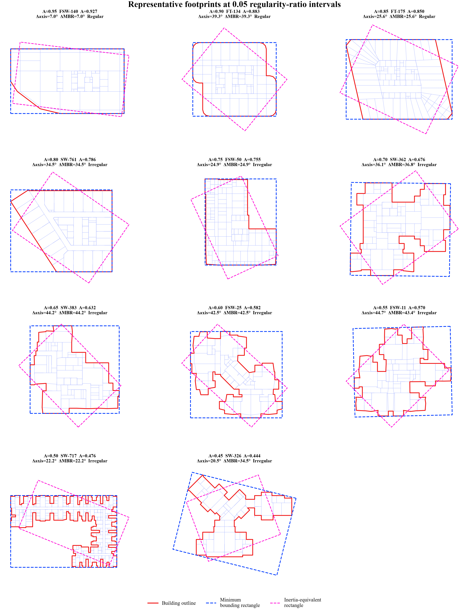
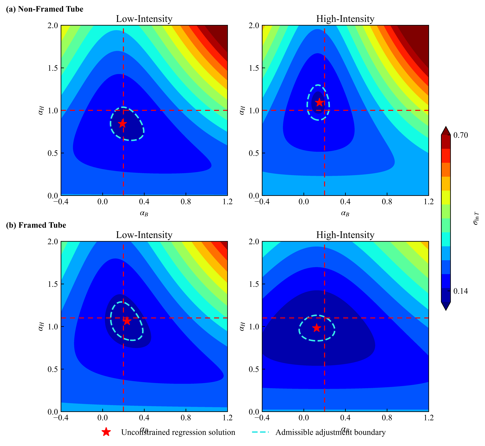
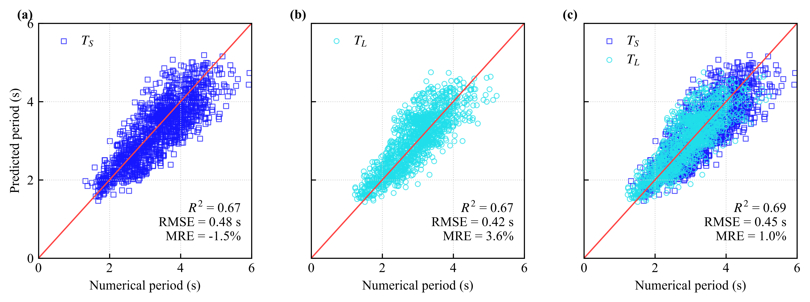
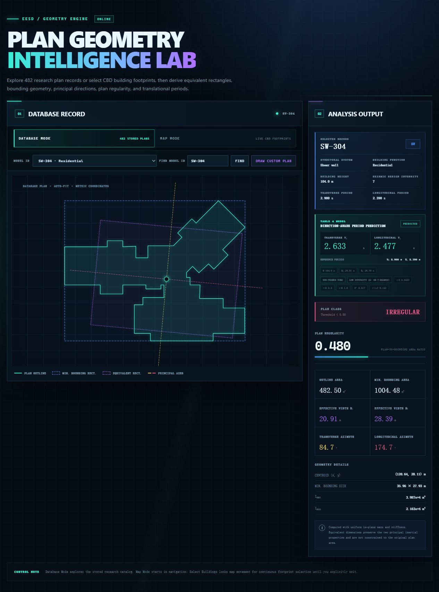
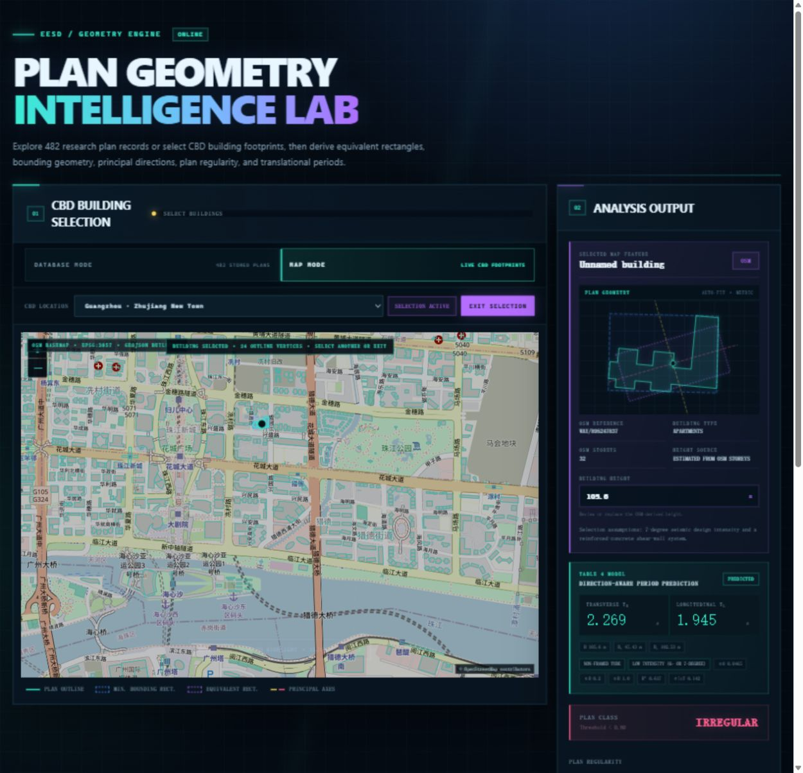

# Direction-Aware Tall-Building Periods

This repository accompanies the study *Direction-Aware Period Prediction for
Seismic Risk Assessment and Application to an Urban Tall Building Portfolio in
China*. It provides two database-driven workflows:

1. **Period prediction** from height, effective width, structural system, and
   seismic design intensity.
2. **Azimuth prediction** from structural-plan geometry, including principal
   translational directions, equivalent rectangles, bounding rectangles, and
   plan regularity.

## Visual overview

### Representative plan geometry



### Period-model coefficient constraints



### Full-data period predictions



## Documentation map

| Workflow | Analysis guide | Database guide |
|---|---|---|
| Period prediction | [analysis/period_prediction/README.md](analysis/period_prediction/README.md) | [data/period_prediction/README.md](data/period_prediction/README.md) |
| Azimuth prediction | [analysis/azimuth_prediction/README.md](analysis/azimuth_prediction/README.md) | [data/azimuth_prediction/README.md](data/azimuth_prediction/README.md) |

Short indexes are also available at [analysis/README.md](analysis/README.md) and
[data/README.md](data/README.md).

## Repository structure

```text
analysis/
  period_prediction/             Period-regression models and figure workflow
  azimuth_prediction/            Geometry, azimuth, database, and plotting code
data/
  period_prediction/             1,333-model CSV and SQLite period database
  azimuth_prediction/            Anonymized plan-geometry database
results/
  period_prediction/             Regression figures, tables, and predictions
  azimuth_prediction/            Geometry examples and their documentation
web/
  README.md                      Interactive website overview
  assets/                        Database, drawing, and map screenshots
schema/
  period_prediction_schema.sql   Period-database schema
  azimuth_prediction_schema.sql  Plan-geometry database schema
scripts/
  build_period_database.py       Rebuild the period SQLite database
  validate_period_database.py    Validate period data and repository policy
  validate_azimuth_database.py   Validate plan geometry and classifications
  update_azimuth_threshold.py    Apply the eta_A = 0.80 threshold
  plot_azimuth_prediction.py     Plot one or all models from SQLite
  generate_azimuth_examples.py   Regenerate the representative example set
tests/
  test_period_prediction.py      Period-analysis tests
  test_azimuth_prediction.py     Geometry and database tests
```

The two top-level result folders mirror the two analysis folders. Paper section
numbers are retained only in explanatory text where useful; they are not used
as package or result-directory names.

## Data at a glance

| Structural system | Code | Records |
|---|---:|---:|
| Shear wall | `SW` | 818 |
| Frame-shear wall | `FSW` | 181 |
| Frame-tube | `FT` | 334 |
| **Total** |  | **1,333** |

The plan-geometry database supplies the normalized outlines and derived metrics
used by the azimuth-prediction workflow. Its identifiers link to the same
period database without exposing private source identifiers.

The plan-regularity ratio is
`eta_A = plan area / minimum-bounding-rectangle area`. The corrected
classification threshold is **0.80**: `eta_A >= 0.80` is regular and
`eta_A < 0.80` is irregular.

## Quick start

Create an environment and install the declared dependencies:

```bash
python -m venv .venv
.venv/Scripts/python -m pip install -r requirements.txt
```

On macOS or Linux, use `.venv/bin/python` instead.

Run the complete period-prediction workflow directly from SQLite:

```bash
python -m analysis.period_prediction.run_analysis
```

Generate one azimuth/geometry result directly from SQLite:

```bash
python scripts/plot_azimuth_prediction.py --model-id SW-701
```

Regenerate all representative regularity-ratio examples:

```bash
python scripts/generate_azimuth_examples.py
```

## Interactive website

The [Plan Geometry Intelligence Lab](http://geo.wwstruct.com) provides an
interactive interface to the same plan-geometry and direction-aware period
methods. It supports three workflows: browsing stored research plans, drawing a
custom polygon with live analysis, and selecting mapped CBD building
footprints.

In Database Mode, select or search a model identifier to inspect its plan,
minimum bounding rectangle, inertia-equivalent rectangle, principal axes,
regularity classification, and predicted transverse and longitudinal periods.



In Map Mode, navigate to a supported CBD, select a building footprint, supply
or review its height, and obtain mapped attributes, plan geometry, and
direction-aware period predictions in one view.



See the [website user guide](web/README.md) for step-by-step operation and the
[azimuth-analysis guide](analysis/azimuth_prediction/README.md#interactive-website-guide)
for calculation details and reproducible Python workflows.

## Validation

```bash
python scripts/validate_period_database.py
python scripts/validate_azimuth_database.py
python -m unittest tests.test_period_prediction tests.test_azimuth_prediction
```

These commands validate database integrity, model counts, units, identifier
linkage, geometry invariants, the 0.80 regularity threshold, privacy-sensitive
schema fields, and numerical regression results.

## Rebuilding data

The canonical period CSV and SQLite database can be rebuilt with public code:

```bash
python scripts/build_period_database.py
```

The private plan-file extraction utility is intentionally excluded. The
published azimuth database already contains the normalized line segments,
ordered outlines, derived metrics, and anonymized model labels needed for all
included analyses.

## Privacy, licenses, and citation

No project names, addresses, coordinates, owner names, phone numbers, private
time-series keys, or absolute source paths are included in the public data or
example documentation.

- Code: MIT License, see [LICENSE](LICENSE).
- Data: CC BY 4.0, see [DATA_LICENSE.md](DATA_LICENSE.md).
- Formal journal and DOI metadata will be added after publication and archive
  release.
