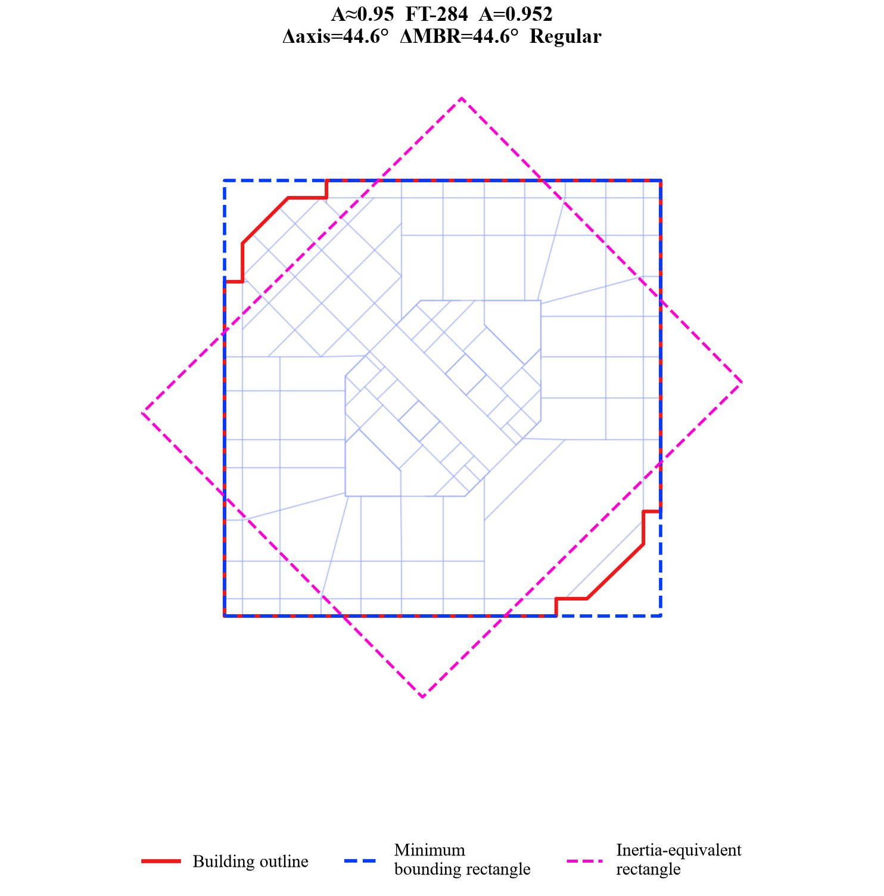
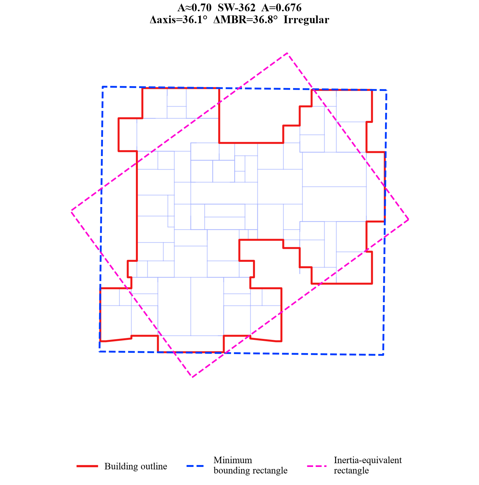
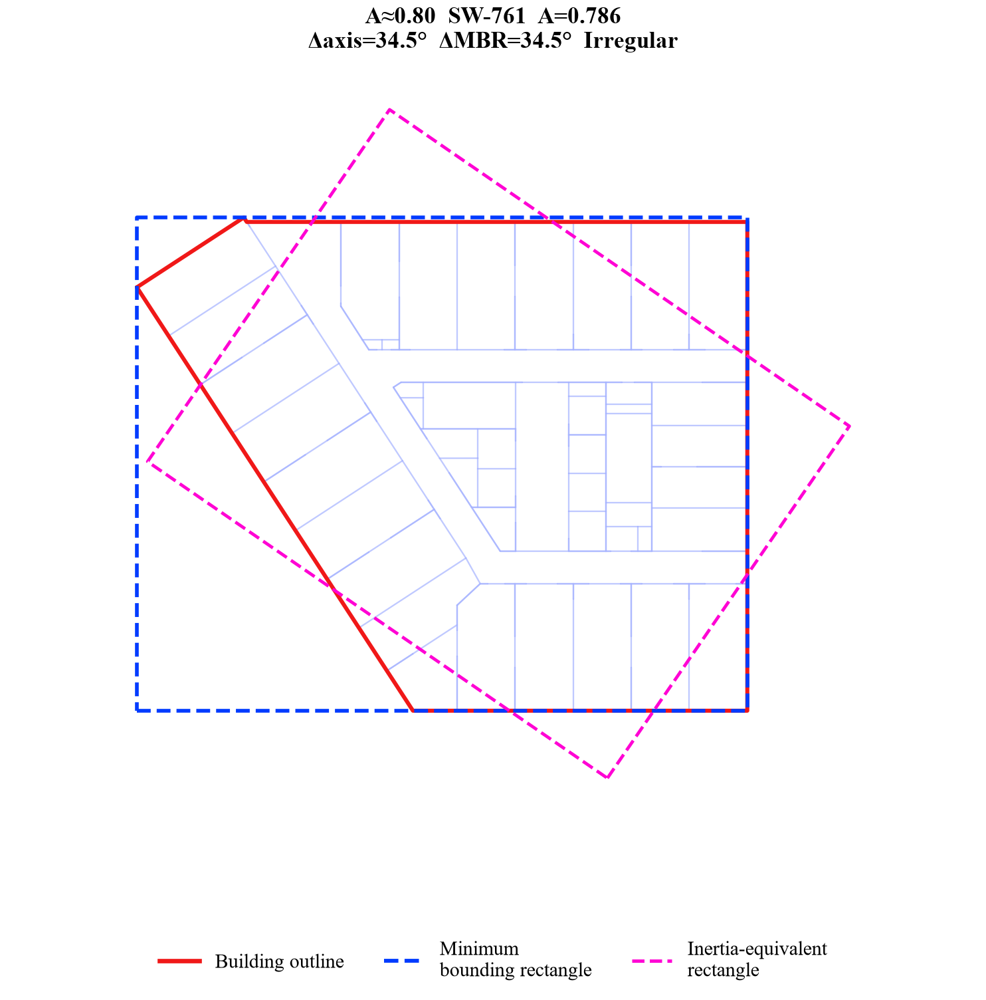
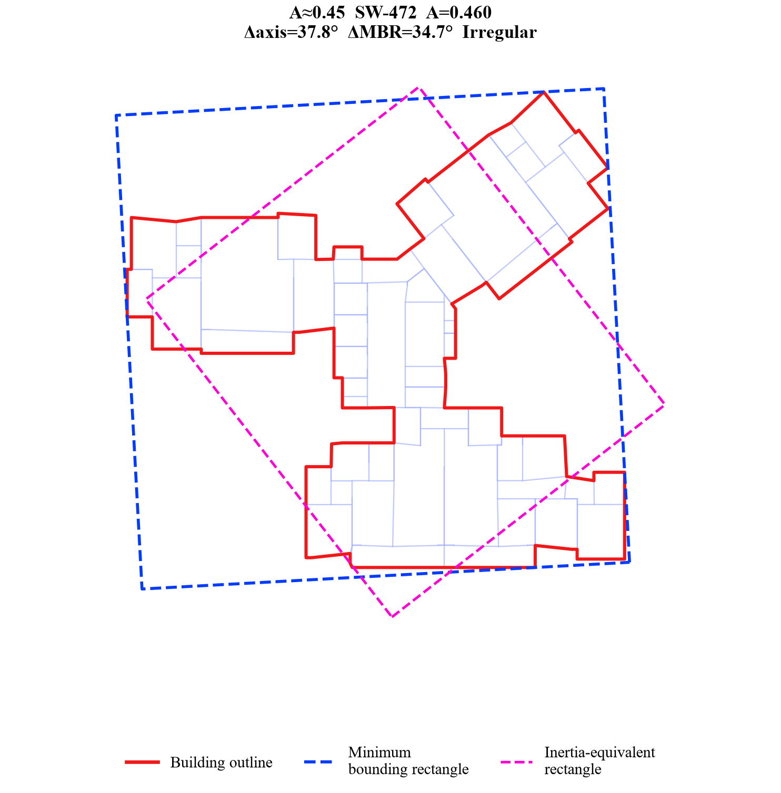

# Azimuth-prediction analysis

## Purpose

This workflow derives the transverse and longitudinal translational azimuths
from the principal axes of each structural-plan outline. It also calculates the
minimum-area bounding rectangle, inertia-equivalent rectangle, effective
widths, and plan-regularity ratio.

All included plots and example selection can be reproduced from
[`data/azimuth_prediction/building_plan_geometry.sqlite`](../../data/azimuth_prediction/README.md)
without access to the private source directories.

## Representative results


Selected individual examples:

| `eta_A` target | Figure | `eta_A` target | Figure |
|---:|---|---:|---|
| 0.95 |  | 0.70 |  |
| 0.80 |  | 0.45 |  |

The complete model list, ratios, angle differences, and image links are in
[regularity_examples.md](../../results/azimuth_prediction/regularity_examples.md).

## Geometry definitions

For an ordered exterior polygon, the analysis computes area, centroid, the
centroidal moments `Ix`, `Iy`, and `Ixy`, and the principal moments. Principal
axes provide orthogonal transverse and longitudinal azimuths in `[0, 180)`.

The equivalent dimensions preserve the principal second moments:

```text
b_transverse   = (144 I_min^3 / I_max)^(1/8)
b_longitudinal = (144 I_max^3 / I_min)^(1/8)
```

Plan regularity is defined as:

```text
eta_A = polygon area / minimum-bounding-rectangle area
```

The corrected threshold is **0.80**:

- `eta_A >= 0.80`: regular;
- `eta_A < 0.80`: irregular.

## Run

Plot one model:

```bash
python scripts/plot_azimuth_prediction.py --model-id SW-701
```

Plot every model:

```bash
python scripts/plot_azimuth_prediction.py --all
```

Regenerate the 0.95-to-0.45 example series and its Markdown index:

```bash
python scripts/generate_azimuth_examples.py
```

The example selector excludes ratios at or above 0.975, uses 0.05 target
intervals, and favors plans whose equivalent rectangle is noticeably rotated
relative to the global axes and minimum bounding rectangle.

## Code separation

| File | Responsibility |
|---|---|
| `geometry.py` | Polygon, inertia, azimuth, rectangle, and regularity algorithms |
| `database.py` | Read-only SQLite queries and model loading |
| `plotting.py` | Presentation-only Matplotlib helpers |
| `scripts/plot_azimuth_prediction.py` | One-model or all-model CLI |
| `scripts/generate_azimuth_examples.py` | Database-driven example selection and rendering |

## Verify

```bash
python scripts/validate_azimuth_database.py
python -m unittest tests.test_azimuth_prediction
```

Validation covers SQLite integrity, foreign keys, model linkage, geometry
invariants, anonymization, and exact agreement between `plan_class` and the
0.80 threshold.
