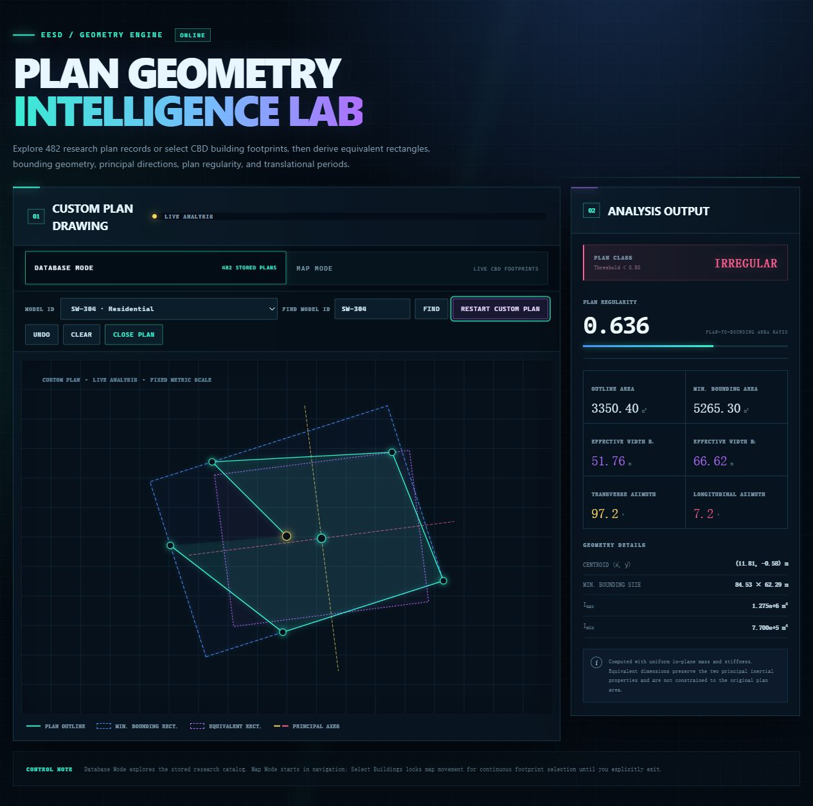

# Azimuth-prediction analysis

## Purpose

This workflow derives the transverse and longitudinal translational azimuths
from the principal axes of each structural-plan outline. It also calculates the
minimum-area bounding rectangle, inertia-equivalent rectangle, effective
widths, and plan-regularity ratio.

All included plots and example selection can be reproduced from
[`data/azimuth_prediction/building_plan_geometry.sqlite`](../../data/azimuth_prediction/README.md)
without access to the private source directories.

## Interactive website guide

Open the [Plan Geometry Intelligence Lab](http://geo.wwstruct.com) in a current
version of Edge, Chrome, Firefox, or Safari. Internet Explorer 11 is not
supported. The application exposes the azimuth and period calculations through
Database Mode, custom-plan drawing, and Map Mode. Results appear in the
**Analysis Output** panel on the right.

### Database Mode: stored building plans

1. Keep **DATABASE MODE** selected. The interface opens with a stored example.
2. Choose a record under **MODEL ID**, or enter an identifier under
   **FIND MODEL ID** and select **FIND**.
3. Review the stored record, effective widths, plan regularity, azimuths, and
   predicted periods in the output panel.
4. Use the legend controls to show or hide the minimum bounding rectangle,
   inertia-equivalent rectangle, and principal axes.


The left panel overlays the building outline, minimum-area bounding rectangle,
equivalent rectangle, and the two orthogonal principal directions. The right
panel reports model metadata, the Table 4 period prediction, regularity class,
area metrics, effective widths, azimuths, centroid, bounding dimensions, and
principal inertias.

### Draw a custom plan

1. Select **DRAW CUSTOM PLAN** to replace the stored outline.
2. Click the metric grid to add vertices in sequence. Live analysis starts when
   three valid, non-collinear vertices are available.
3. Drag any vertex to refine the geometry. Use **UNDO** to remove the latest
   point or **CLEAR** to remove all points.
4. Select **CLOSE PLAN** when the outline is valid.



Custom drawing is useful for testing a conceptual plan before a database model
or mapped footprint is available. If the points are nearly collinear or enclose
negligible area, analysis waits until the geometry becomes valid.

### Map Mode: select a CBD building

1. Select **MAP MODE**, then choose a city under **CBD LOCATION**.
2. Pan and zoom in **MAP NAVIGATION** until the target area is visible.
3. Select **SELECT BUILDINGS** and wait for the public footprints to load.
4. Hover to highlight a footprint, then click it to create the plan and run the
   analysis. Continue selecting other buildings as needed.
5. Review or enter the building height when the public feature does not provide
   a reliable value.
6. Select **EXIT SELECTION** to restore map navigation.


Map Mode combines the selected public footprint with available OpenStreetMap
attributes. Some buildings do not contain usable height or storey tags, so a
height may need to be supplied before period prediction can be completed.

### Interface and output reference

| Interface item | Meaning |
|---|---|
| **PLAN OUTLINE** | Imported, stored, drawn, or selected building footprint. |
| **MIN. BOUNDING RECT.** | Minimum-area rectangle enclosing the plan. |
| **EQUIVALENT RECT.** | Rectangle derived from the two principal inertial properties. |
| **PRINCIPAL AXES** | Orthogonal transverse and longitudinal principal directions. |
| **PLAN REGULARITY** | Plan area divided by minimum bounding-rectangle area; 0.80 is the classification threshold. |
| **PERIOD PREDICTION** | Direction-aware estimates using height, effective width, structural class, seismic intensity, and the Table 4 parameters. |

### Website troubleshooting

- **Blank page:** use a supported browser and force-refresh the page.
- **Map visible but buildings cannot be selected:** exit selection, pan or zoom
  to another view, then select **SELECT BUILDINGS** again. Public building data
  can take several seconds to respond.
- **No custom-plan result:** add at least three non-collinear vertices, or drag
  an existing vertex until the polygon has a non-negligible area.
- **Building height unavailable:** enter a defensible height manually when the
  mapped feature has no usable height or storey metadata.

## Representative results


Selected individual examples:

| `eta_A` target | Figure | `eta_A` target | Figure |
|---:|---|---:|---|
| 0.95 |  | 0.70 |  |
| 0.80 |  | 0.45 |  |

The complete model list, ratios, angle differences, and image links are in
[regularity_examples.md](../../results/azimuth_prediction/regularity_examples.md).

## Geometry definitions

For an ordered exterior polygon, the analysis computes area, centroid, the
centroidal moments `Ix`, `Iy`, and `Ixy`, and the principal moments. Principal
axes provide orthogonal transverse and longitudinal azimuths in `[0, 180)`.

The equivalent dimensions preserve the principal second moments:

```text
b_transverse   = (144 I_min^3 / I_max)^(1/8)
b_longitudinal = (144 I_max^3 / I_min)^(1/8)
```

Plan regularity is defined as:

```text
eta_A = polygon area / minimum-bounding-rectangle area
```

The corrected threshold is **0.80**:

- `eta_A >= 0.80`: regular;
- `eta_A < 0.80`: irregular.

## Run

Plot one model:

```bash
python scripts/plot_azimuth_prediction.py --model-id SW-701
```

Plot every model:

```bash
python scripts/plot_azimuth_prediction.py --all
```

Regenerate the 0.95-to-0.45 example series and its Markdown index:

```bash
python scripts/generate_azimuth_examples.py
```

The example selector excludes ratios at or above 0.975, uses 0.05 target
intervals, and favors plans whose equivalent rectangle is noticeably rotated
relative to the global axes and minimum bounding rectangle.

## Code separation

| File | Responsibility |
|---|---|
| `geometry.py` | Polygon, inertia, azimuth, rectangle, and regularity algorithms |
| `database.py` | Read-only SQLite queries and model loading |
| `plotting.py` | Presentation-only Matplotlib helpers |
| `scripts/plot_azimuth_prediction.py` | One-model or all-model CLI |
| `scripts/generate_azimuth_examples.py` | Database-driven example selection and rendering |

## Verify

```bash
python scripts/validate_azimuth_database.py
python -m unittest tests.test_azimuth_prediction
```

Validation covers SQLite integrity, foreign keys, model linkage, geometry
invariants, anonymization, and exact agreement between `plan_class` and the
0.80 threshold.
